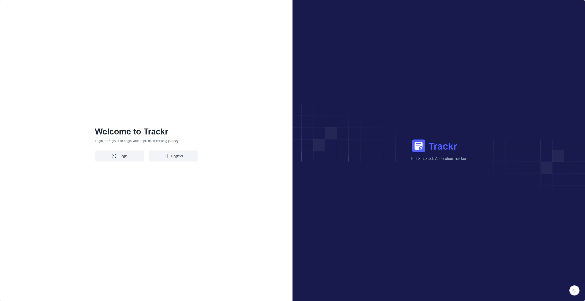

###### Check out the demo

Open [trackr-two.vercel.app/](trackr-two.vercel.app/) to view it in the browser.

# Trackr

This is a web application job application tracker with features for managing application entries.

## Project Details

This project was bootstrapped with Next.js, Tailwind CSS, and PostgreSQL, hosted on Vercel.

## Preview




## Installation & Set Up

1. Clone the Repository

   ```sh
   git clone https://github.com/jackiedl/job-app-tracker.git
   cd job-application-tracker
   ```

2. Install Dependencies

   ```sh
   npm install
   ```

3. Configure Environment Variables

   ```env
   # .env.local

   DATABASE_URL=postgresql://<user>:<password>@<host>:<port>/<database>?schema=public
   AUTH_SECRET=your-secret-key
   AUTH_URL=http://localhost:3000/api/auth
   ```

4. Run Development Server

   ```sh
   pnpm run
   ```
Open http://localhost:3000 in your browser.

5. (Optional) Seed your database

    Navigate to localhost:3000/seed in your browser. When finished, you will see a message "Database seeded successfully" in the browser. 